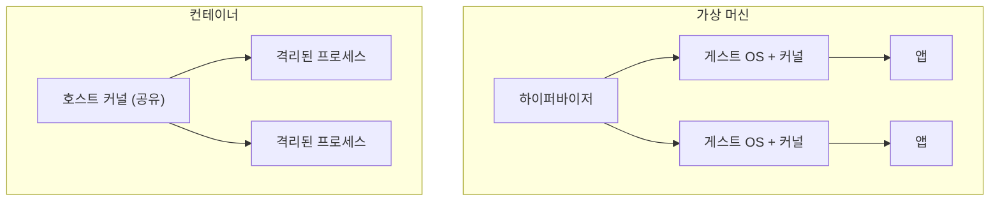
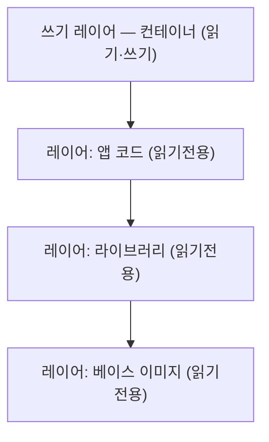
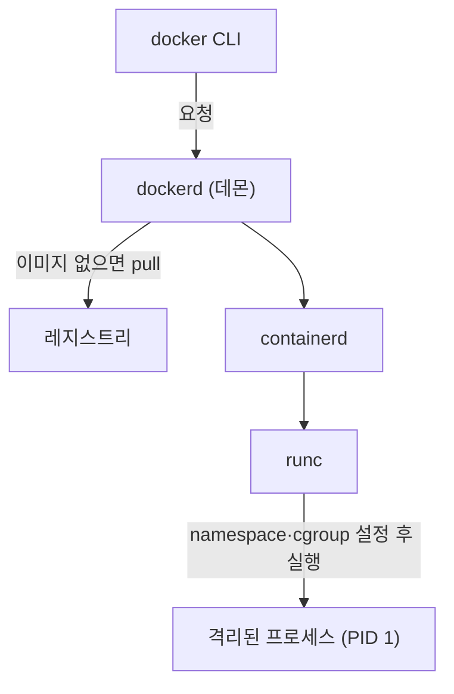

# 한 줄 요약

Docker의 컨테이너는 작은 가상머신(VM)이 아니다. **리눅스 커널이 이미 가진 기능들** — 격리(namespace), 자원 제한(cgroup), 겹쳐 쌓는 파일시스템(union filesystem) — 을 조합해 **하나의 프로세스를 격리해 실행**하는 것이 전부다.

<aside class="callout callout--note"><span class="callout-icon" aria-hidden="true">🎯</span><div class="callout-body"><p>핵심 한마디: <strong>컨테이너는 "가벼운 가상머신"이 아니라, 리눅스가 칸막이를 쳐서 격리한 프로세스 하나</strong>다. 그래서 별도 OS 부팅이 없어 빠르다.</p></div></aside>

# 1. 왜 내부를 알아야 할까

컨테이너를 "작은 VM"이라고 생각하면 자꾸 오해가 생긴다. 내부를 알면 이런 게 풀린다.

- **왜 빠른가** — OS를 새로 켜지 않고 호스트 커널을 공유하기 때문.

- **보안 경계는 어디인가** — 커널을 공유하므로, 커널 취약점은 컨테이너 격리를 넘을 수 있다.

- **왜 이미지가 가벼운가** — 레이어를 재사용하기 때문.

# 2. 오해부터 풀기 — 가상머신 vs 컨테이너

둘 다 "격리"를 제공하지만 방식이 완전히 다르다.



<div class="table-wrap"><table><tr><th>구분</th><th>가상 머신</th><th>컨테이너</th></tr><tr><td>격리 단위</td><td>게스트 OS 전체(커널 포함)</td><td>프로세스(커널은 공유)</td></tr><tr><td>시작 속도</td><td>느림(OS 부팅)</td><td>빠름(프로세스 실행)</td></tr><tr><td>자원 사용</td><td>무거움</td><td>가벼움</td></tr><tr><td>격리 강도</td><td>강함(커널 분리)</td><td>상대적으로 약함(커널 공유)</td></tr></table></div>

# 3. Docker를 떠받치는 리눅스 3대 기능

컨테이너는 이 세 가지 커널 기능의 조합이다.

<div class="table-wrap"><table><tr><th>기능</th><th>역할</th><th>한마디로</th></tr><tr><td><strong>namespace</strong></td><td>무엇을 "볼 수 있는가"를 분리</td><td>칸막이</td></tr><tr><td><strong>cgroup</strong></td><td>자원을 "얼마나 쓸 수 있는가"를 제한</td><td>사용량 상한</td></tr><tr><td><strong>union filesystem</strong></td><td>파일시스템을 레이어로 겹쳐 구성</td><td>투명 필름 쌓기</td></tr></table></div>

## 3-1. namespace — "무엇을 보는가"를 나눔

같은 컴퓨터 안에 있어도, 컨테이너는 자기만의 세상만 본다. 프로세스 목록·네트워크·호스트명 등을 각각 분리한다.

<aside class="callout callout--tip"><span class="callout-icon" aria-hidden="true">💡</span><div class="callout-body"><p>비유: <strong>여러 사람이 각자 다른 방에 있는 것.</strong> 방 안에서는 자기 방만 보이고 옆 방은 안 보인다. 실제로는 한 건물(호스트)에 있지만, 각자 독립된 공간처럼 느낀다.</p></div></aside>

주요 namespace:

- **PID** — 프로세스 목록 분리. 컨테이너 안에서는 자기 프로세스만 보이고, 첫 프로세스가 PID 1이 된다.

- **mount** — 파일시스템 마운트 지점 분리.

- **network** — 네트워크 인터페이스·IP·포트 분리.

- **UTS** — 호스트명 분리.

- **user** — 사용자 ID 분리(컨테이너의 root ≠ 호스트의 root로 매핑 가능).

## 3-2. cgroup — "얼마나 쓰는가"를 제한

격리만으론 부족하다. 한 컨테이너가 CPU·메모리를 다 먹으면 다른 컨테이너가 죽는다. cgroup은 자원 사용량을 제한·측정한다.

<aside class="callout callout--tip"><span class="callout-icon" aria-hidden="true">💡</span><div class="callout-body"><p>비유: <strong>각 방에 전기·수도 총량을 정해두는 것.</strong> 한 방이 다 써버려 다른 방이 멈추는 걸 막는다.</p></div></aside>

- CPU 사용률, 메모리 상한, 디스크 I/O, 프로세스 개수 등을 제한한다.

- `docker run --memory=512m --cpus=1` 같은 옵션이 결국 cgroup 설정으로 이어진다.

## 3-3. union filesystem — 이미지를 레이어로

이미지는 하나의 통짜 파일이 아니라 **읽기 전용 레이어를 여러 겹 쌓은 것**이다. 컨테이너는 그 위에 **쓰기 레이어 하나**를 얹는다.



<aside class="callout callout--tip"><span class="callout-icon" aria-hidden="true">💡</span><div class="callout-body"><p>비유: <strong>투명 필름을 겹쳐 하나의 그림처럼 보는 것.</strong> 아래 필름(읽기전용)은 그대로 두고, 변경은 맨 위 필름(쓰기 레이어)에만 기록한다. 이것을 <strong>copy-on-write</strong>(바뀔 때만 복사)라고 한다.</p></div></aside>

- 여러 컨테이너가 같은 읽기전용 레이어를 **공유**하므로 디스크가 절약된다.

- 파일을 수정하면 원본을 건드리지 않고 쓰기 레이어에 복사본을 만들어 바꾼다.

# 4. 이미지와 컨테이너의 관계


- **이미지** = 배포 가능한 불변 템플릿(읽기전용 레이어 + 실행 설정).

- **컨테이너** = 이미지 위에 쓰기 레이어를 얹어 실제로 실행한 인스턴스.

- 같은 이미지로 컨테이너를 여러 개 띄워도, 각자 자기 쓰기 레이어만 따로 갖는다.

# 5. `docker run` 하면 실제로 벌어지는 일

명령 한 줄 뒤에서 여러 구성요소가 협력한다.



1. `docker` CLI가 백그라운드 데몬 **dockerd**에 요청을 보낸다.

1. 로컬에 이미지가 없으면 **레지스트리**에서 pull 한다.

1. 이미지 레이어 위에 **쓰기 레이어**를 만든다.

1. **containerd → runc**가 namespace·cgroup을 설정해 격리 환경을 준비한다.

1. 지정된 프로세스가 컨테이너 안에서 **PID 1**로 시작된다.

1. 그 **PID 1 프로세스가 끝나면 컨테이너도 종료**된다.

<details class="toggle"><summary>구성요소 한 줄 정리 (dockerd · containerd · runc)</summary><div class="toggle-body"><ul><li><strong>dockerd</strong> — 우리가 내리는 명령을 받는 Docker 데몬. 이미지·네트워크·볼륨을 관리.</li><li><strong>containerd</strong> — 컨테이너의 생명주기(생성·시작·정지)를 실제로 관리하는 런타임.</li><li><strong>runc</strong> — namespace·cgroup을 세팅해 컨테이너 프로세스를 실제로 띄우는 가장 낮은 계층 도구.</li></ul></div></details>

# 6. 예제 — 격리를 눈으로 확인

컨테이너를 하나 띄우고 안에서 살펴보면 격리가 체감된다.

```bash
docker run --rm -it --name demo alpine sh
```

```bash
# 컨테이너 안에서 실행
ps aux      # 컨테이너 자기 프로세스만 보임 (PID namespace)
hostname    # 호스트와 다른 고유 이름 (UTS namespace)
ip addr     # 컨테이너 전용 네트워크 인터페이스 (network namespace)
```

<details class="toggle"><summary>무엇을 확인하는 건가?</summary><div class="toggle-body"><ul><li><code>ps aux</code>에 호스트의 수많은 프로세스가 안 보이고 몇 개만 보인다 → <strong>PID namespace로 프로세스 목록이 분리</strong>됨.</li><li><code>hostname</code>이 컨테이너 고유값이다 → <strong>UTS namespace로 호스트명이 분리</strong>됨.</li><li>즉, 같은 컴퓨터인데도 컨테이너는 "자기 세상"만 본다.</li></ul></div></details>

# 7. 함정과 방지책

<aside class="callout callout--warn"><span class="callout-icon" aria-hidden="true">🧨</span><div class="callout-body"><p><strong>함정 1 — 컨테이너를 VM처럼 믿는다.</strong> 커널을 공유하므로, 커널 취약점이나 잘못된 권한 설정은 격리를 넘을 수 있다.</p><p><strong>방지:</strong> 신뢰할 수 있는 이미지만 사용하고, 최소 권한 원칙을 지킨다.</p></div></aside>

<aside class="callout callout--warn"><span class="callout-icon" aria-hidden="true">🧨</span><div class="callout-body"><p><strong>함정 2 — 컨테이너를 root로 실행.</strong> 컨테이너의 root가 호스트에 영향을 줄 위험이 있다.</p><p><strong>방지:</strong> 비-root 사용자로 실행하고, 필요하면 user namespace로 권한을 낮춘다.</p></div></aside>

<aside class="callout callout--warn"><span class="callout-icon" aria-hidden="true">🧨</span><div class="callout-body"><p><strong>함정 3 — 중요한 데이터를 쓰기 레이어에 저장.</strong> 쓰기 레이어는 컨테이너를 지우면 함께 사라진다.</p><p><strong>방지:</strong> 지속 데이터는 <strong>volume</strong>이나 외부 저장소에 둔다.</p></div></aside>

<aside class="callout callout--warn"><span class="callout-icon" aria-hidden="true">🧨</span><div class="callout-body"><p><strong>함정 4 — </strong><code>latest</code><strong> 태그 사용.</strong> 언제 무엇이 실행됐는지 알기 어렵고 재현이 깨진다.</p><p><strong>방지:</strong> 이미지 태그로 버전을 고정한다(예: <code>alpine:3.20</code>).</p></div></aside>

# 8. 정리하자면

<aside class="callout callout--note"><span class="callout-icon" aria-hidden="true">🙋</span><div class="callout-body"><p>커널 안에서 돌아가는 하나의 프로세스로써 권한에 대해서 조심히 하면서 사용해야하며 도커 이미지를 이용한 컨테이너 기술을 사용하면 환경이 다르더라도 일관성이 있고 배포 확장이 편하다는 장점이 있다.
aws 공부를 하면서 도커 이미지의 경우 EC2 AMI와 비슷하다는 생각이 들었다.</p></div></aside>
