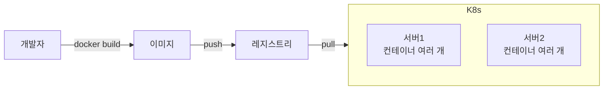
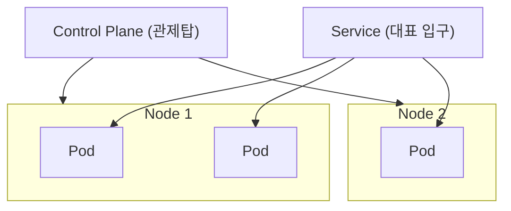

# 한 줄 요약

Docker는 앱을 **컨테이너 한 개로 포장해서 실행**하는 도구이고, Kubernetes(쿠버네티스, k8s)는 그 컨테이너를 **여러 대의 서버에 걸쳐 자동으로 배치·확장·복구**해주는 "관리자"다.

<aside class="callout callout--note"><span class="callout-icon" aria-hidden="true">🎯</span><div class="callout-body"><p>쉽게 말하면: <strong>Docker는 컨테이너를 "만들고 실행", Kubernetes는 수많은 컨테이너를 "지휘".</strong> 요리사 한 명(Docker) vs 주방 전체를 돌리는 매니저(Kubernetes)라고 보면 된다.</p></div></aside>

# 1. 왜 필요한가 — Docker만으론 부족한 순간

컨테이너 한두 개는 `docker run`으로 충분하다. 하지만 실제 서비스가 커지면 이런 게 필요해진다.

- 트래픽이 몰리면 컨테이너를 10개, 100개로 **늘렸다 줄였다** 해야 한다.

- 컨테이너가 죽으면 **자동으로 다시 띄워야** 한다.

- 여러 대의 서버에 **골고루 나눠 배치**해야 한다.

- 새 버전을 **무중단으로 교체(롤아웃)** 해야 한다.

이걸 사람이 손으로 하긴 불가능하다. 그래서 **오케스트레이션 도구(Kubernetes)** 가 대신 해준다.

<aside class="callout callout--warn"><span class="callout-icon" aria-hidden="true">⚠️</span><div class="callout-body"><p><strong>Docker와 Kubernetes는 경쟁 관계가 아니다.</strong> Docker는 "컨테이너 한 개를 어떻게 실행하나", Kubernetes는 "컨테이너 수백 개를 어떻게 운영하나"를 다룬다. 층위가 다르고, 쿠버네티스는 내부에서 컨테이너를 실행하려고 컨테이너 런타임을 그대로 쓴다.</p></div></aside>

# 2. 큰 그림 — 둘의 관계



Docker로 만든 **이미지**를 레지스트리에 올리면, Kubernetes가 그걸 가져와 **여러 서버에 알아서 나눠 실행**한다.

# 3. Kubernetes 핵심 개념 (용어 지도)

처음 보면 용어가 많아 겁나지만, 아래 6개만 잡으면 절반은 이해한 거다.

<div class="table-wrap"><table><tr><th>개념</th><th>쉽게 말하면</th><th>비유</th></tr><tr><td><strong>Pod</strong></td><td>컨테이너를 담는 가장 작은 실행 단위(보통 컨테이너 1개).</td><td>상자를 올린 운반 트레이</td></tr><tr><td><strong>Node</strong></td><td>Pod가 실제로 도는 서버(가상/물리).</td><td>일하는 작업대</td></tr><tr><td><strong>Cluster</strong></td><td>여러 Node + 이를 관리하는 두뇌의 집합.</td><td>공장 전체</td></tr><tr><td><strong>Deployment</strong></td><td>"이 앱을 3개 띄워줘" 같은 원하는 상태 선언.</td><td>주문서</td></tr><tr><td><strong>Service</strong></td><td>여러 Pod로 향하는 고정 입구(자동 분배).</td><td>대표 전화번호</td></tr><tr><td><strong>Control Plane</strong></td><td>클러스터 전체를 조율하는 두뇌.</td><td>관제탑</td></tr></table></div>



# 4. 쿠버네티스의 핵심 원리 — "선언형" 운영

쿠버네티스가 강력한 이유는 **선언형(declarative)** 방식이기 때문이다.

<aside class="callout callout--note"><span class="callout-icon" aria-hidden="true">📌</span><div class="callout-body"><p><strong>명령형 vs 선언형.</strong> 명령형은 "컨테이너를 켜라 / 꺼라"를 일일이 지시하는 것이고, 선언형은 <strong>"항상 3개가 떠 있어야 해"라는 목표만 적어두는 것</strong>이다. 쿠버네티스는 현재 상태를 계속 지켜보다가 목표와 어긋나면 스스로 맞춘다.</p></div></aside>


이 반복 감시 덕분에 Pod가 죽어도 **알아서 새로 띄우는(self-healing)** 것이다.

# 5. 예제 — 앱 하나 띄우기

"nginx 앱을 3개 띄워라"를 선언하는 파일이다.

```yaml
apiVersion: apps/v1
kind: Deployment
metadata:
  name: web
spec:
  replicas: 3            # 항상 3개 유지
  selector:
    matchLabels: { app: web }
  template:
    metadata:
      labels: { app: web }
    spec:
      containers:
        - name: web
          image: nginx:1.27   # 버전 고정
```

```bash
kubectl apply -f web.yaml    # 선언 적용
kubectl get pods             # 떠 있는 Pod 확인
kubectl scale deployment/web --replicas=5   # 5개로 확장
```

<details class="toggle"><summary>이 파일, 쉽게 풀어보기</summary><div class="toggle-body"><ul><li><code>kind: Deployment</code> — "앱을 몇 개 유지할지" 관리하는 종류</li><li><code>replicas: 3</code> — 항상 3개 떠 있게 해줘 (하나 죽으면 자동 보충)</li><li><code>image: nginx:1.27</code> — 이 이미지로 컨테이너를 만든다</li><li><code>kubectl apply</code> — 이 "원하는 상태"를 클러스터에 등록</li></ul><p>즉 <strong>"어떻게"가 아니라 "무엇을 원하는지"만 적는다.</strong></p></div></details>

# 6. 함정과 방지책

<aside class="callout callout--warn"><span class="callout-icon" aria-hidden="true">🧨</span><div class="callout-body"><p><strong>함정 1 — 처음부터 쿠버네티스 도입.</strong> 작은 서비스에 k8s는 과한 복잡도(오버엔지니어링)다.</p><p><strong>해결:</strong> 컨테이너 몇 개면 <code>docker compose</code>로 충분. 규모·무중단·자동확장이 필요해질 때 도입한다.</p></div></aside>

<aside class="callout callout--warn"><span class="callout-icon" aria-hidden="true">🧨</span><div class="callout-body"><p><strong>함정 2 — Pod를 영구 저장소로 착각.</strong> Pod는 언제든 죽고 새로 뜨며, 안에 저장한 데이터는 사라진다.</p><p><strong>해결:</strong> 데이터는 PersistentVolume이나 외부 DB에 둔다. Pod는 "일회용"으로 설계.</p></div></aside>

<aside class="callout callout--warn"><span class="callout-icon" aria-hidden="true">🧨</span><div class="callout-body"><p><strong>함정 3 — 이미지 </strong><code>latest</code><strong> 태그 사용.</strong> 언제 무엇이 배포됐는지 알 수 없고 롤백이 어렵다.</p><p><strong>해결:</strong> <code>nginx:1.27</code>처럼 버전을 고정한다.</p></div></aside>

<aside class="callout callout--warn"><span class="callout-icon" aria-hidden="true">🧨</span><div class="callout-body"><p><strong>함정 4 — 리소스 요청/제한 미설정.</strong> 한 Pod가 메모리를 다 먹어 다른 Pod가 죽거나 배치가 꼬인다.</p><p><strong>해결:</strong> <code>requests</code>/<code>limits</code>로 CPU·메모리 상·하한을 정한다.</p></div></aside>

# 7. 정리하자면

<aside class="callout callout--note"><span class="callout-icon" aria-hidden="true">🙋</span><div class="callout-body"><p>SK 하이닉스 프로젝트를 하면서 kubernetes k8s 환경을 처음 접해봤는데 기존에 docker 만 사용했을 때와는 다르게 docker와 kubernetes를 같이 활용한다면 새로운 클라우드 환경에서도 언제든지 쉽게 서비스를 올릴 수 있겠다라는 생각이 들었다.</p></div></aside>
