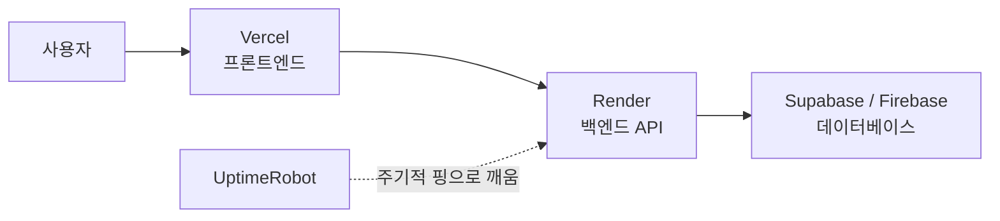

# 한 줄 요약

프론트는 **Vercel**, 백엔드는 **Render**, DB는 **Supabase(또는 Firebase)** — 돈 안 들이고 웹 서비스를 띄우는 조합이다. Render 무료 플랜이 "잠드는(sleep)" 문제는 **UptimeRobot**으로 주기적으로 깨워 해결한다.

<aside class="callout callout--note">🎯

구성 = 배포(Vercel) + 실행(Render) + DB(Supabase/Firebase) + 깨우기(UptimeRobot). 네 가지 모두 <strong>무료 플랜</strong>으로 시작할 수 있다.

</aside>

# 1. 전체 구성

# 2. 각 서비스의 역할

<table><tr><th>서비스</th><th>역할</th><th>프리티어 특징</th></tr><tr><td><strong>Vercel</strong></td><td>프론트엔드 배포(정적·서버리스)</td><td>Git 연동 자동 배포</td></tr><tr><td><strong>Render</strong></td><td>백엔드(API 서버) 실행</td><td>15분 미사용 시 <strong>sleep</strong>(cold start)</td></tr><tr><td><strong>UptimeRobot</strong></td><td>가동 상태 모니터링</td><td>5분마다 핑 → Render 잠들기 방지</td></tr><tr><td><strong>Supabase / Firebase</strong></td><td>데이터베이스·인증</td><td>Supabase=Postgres(관계형), Firebase=Firestore(NoSQL)</td></tr></table>

# 3. 핵심 — Render 프리티어의 sleep과 해결

Render 무료 웹 서비스는 **15분간 요청이 없으면 잠든다(spin down)**. 다음 요청 때 다시 깨어나느라 첫 응답이 수십 초 느려진다(cold start).

<aside class="callout callout--tip">💡

<strong>해결:</strong> UptimeRobot에 백엔드의 헬스체크 URL을 등록하고 <strong>5분 간격으로 핑</strong>하게 하면, 서비스가 계속 깨어 있어 cold start가 사라진다.

</aside>

<aside class="callout callout--warn">⚠️

다만 계속 깨우면 <strong>무료 실행시간을 더 소모</strong>한다. Render 무료는 월 실행시간 한도가 있으니 확인하고, 각 서비스 약관도 체크한다.

</aside>

# 4. 시작 순서 (예시)

1. GitHub 저장소 준비(프론트·백엔드).

1. **Vercel**에 프론트 연결 → 자동 배포.

1. **Render**에 백엔드 연결 → 배포(환경변수 설정).

1. **Supabase/Firebase**에서 DB 생성 → 연결 정보·키를 백엔드 환경변수에 넣기.

1. **UptimeRobot**에 백엔드 헬스체크 URL 등록(5분 간격).

# 5. 함정과 주의

<aside class="callout callout--warn">🧨

<strong>프리티어 한도.</strong> 트래픽·월 실행시간·DB 용량·요청 수 제한이 있다. 서비스가 커지면 유료로 올려야 할 수 있다.

</aside>

<aside class="callout callout--warn">🧨

<strong>다른 서비스도 잠들 수 있다.</strong> Supabase 무료 프로젝트는 일정 기간 미사용 시 일시정지될 수 있고, Firebase는 읽기/쓰기 쿼터가 있다.

</aside>

<aside class="callout callout--warn">🧨

<strong>비밀키는 코드·깃에 넣지 않는다.</strong> DB 연결 문자열·API 키는 각 플랫폼의 <strong>환경변수/시크릿</strong>으로 주입한다.

</aside>

# 6. 정리하자면

<aside class="callout callout--note">🙋

개인 프로젝트를 포트폴리오로 올리기 위해서 사용하기엔 충분히 적합하다. 작성자 본인도 그러한 용도로 사용하고 있다.
추후에 비용적인 여유가 있다면 물리적인 서버를 집에 구성해서 나만의 서버를 구성하고 싶다.

</aside>
