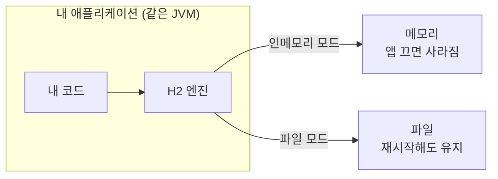

# 한 줄 요약

H2는 **자바로 만든 가벼운 관계형 데이터베이스**다. 별도로 설치·서버 실행할 필요 없이 **내 애플리케이션 안에서 바로 돌아가기** 때문에, 주로 **개발과 테스트**에 쓴다.

<aside class="callout callout--note"><span class="callout-icon" aria-hidden="true">🎯</span><div class="callout-body"><p>비유: MySQL 같은 정식 DB가 <strong>"마당에 따로 지은 창고"</strong> 라면, H2는 <strong>"내 책상 서랍"</strong> 이다. 설치도 열쇠도 필요 없고 바로 쓸 수 있지만, 진짜 짐을 장기 보관하는 곳은 아니다.</p></div></aside>

# 1. 왜 쓰나

개발 시작할 때부터 MySQL을 설치하고 계정·스키마를 만드는 건 번거롭다. H2는 그 과정을 건너뛴다.

- **설치 없이 즉시 시작** — 의존성만 추가하면 끝. 팀원마다 DB 설치할 필요 없음.

- **테스트가 빠르고 깔끔함** — 메모리에서 돌아 빠르고, 테스트마다 **새 DB**로 시작할 수 있다.

- **진짜 SQL을 쓴다** — 가짜 객체가 아니라 실제 관계형 DB라, JPA·쿼리가 정말 동작하는지 확인된다.

# 2. 실행 모드 — 이게 핵심

H2를 헷갈리는 이유는 모드가 여럿이기 때문이다. **어디에 저장하느냐**가 가른다.



<div class="table-wrap"><table><tr><th>모드</th><th>저장 위치</th><th>언제 쓰나</th></tr><tr><td><strong>인메모리</strong></td><td>메모리 (앱 종료 시 <strong>소멸</strong>)</td><td>테스트, 빠른 실험</td></tr><tr><td><strong>파일(임베디드)</strong></td><td>로컬 파일 (재시작해도 유지)</td><td>로컬 개발 중 데이터 유지</td></tr><tr><td><strong>서버</strong></td><td>별도 프로세스 (네트워크로 접속)</td><td>여러 앱이 같은 H2를 공유</td></tr></table></div>

<aside class="callout callout--tip"><span class="callout-icon" aria-hidden="true">💡</span><div class="callout-body"><p><strong>임베디드(embedded)</strong> 란 H2가 <strong>내 앱과 같은 프로세스 안에서</strong> 돌아간다는 뜻이다. 그래서 네트워크 왜곡이 없어 빠르고, 앱을 끄면 DB도 같이 꺼진다.</p></div></aside>

# 3. 예제 — Spring Boot에서 쓰기

의존성 하나면 끝이다.

```groovy
// build.gradle
runtimeOnly 'com.h2database:h2'
```

```yaml
# application.yml
spring:
  datasource:
    url: jdbc:h2:mem:testdb   # 인메모리 모드
    username: sa
    password:
  h2:
    console:
      enabled: true           # 브라우저에서 /h2-console 접속
```

<details class="toggle"><summary><code>jdbc:h2:mem:testdb</code> 한 줄 풀어보기</summary><div class="toggle-body"><ul><li><code>jdbc:h2:</code> — H2 드라이버로 접속한다</li><li><code>mem:</code> — <strong>메모리에</strong> 만든다 (앱 끄면 사라짐)</li><li><code>testdb</code> — DB 이름</li></ul><p>파일로 유지하고 싶으면 <code>jdbc:h2:file:./data/mydb</code> 처럼 경로를 준다.</p></div></details>

**H2 콘솔**: 브라우저로 `/h2-console`에 접속하면 SQL을 직접 실행해볼 수 있다. 테이블이 잘 만들었는지 눈으로 확인할 때 편하다.

# 4. 함정과 방지책

<aside class="callout callout--warn"><span class="callout-icon" aria-hidden="true">🧨</span><div class="callout-body"><p><strong>함정 1 — 운영에 H2를 쓴다.</strong> H2는 개발·테스트용이다. 운영에 필요한 안정성·백업·운영 도구가 부족하다.</p><p><strong>방지:</strong> 운영은 MySQL·PostgreSQL 등 정식 DB를 쓴다.</p></div></aside>

<aside class="callout callout--warn"><span class="callout-icon" aria-hidden="true">🧨</span><div class="callout-body"><p><strong>함정 2 — "데이터가 자꾸 사라져요".</strong> 인메모리 모드는 앱을 끄면 <strong>당연히</strong> 사라진다. 버그가 아니다.</p><p><strong>방지:</strong> 유지하고 싶으면 <code>jdbc:h2:file:...</code> 파일 모드로 바꿈.</p></div></aside>

<aside class="callout callout--warn"><span class="callout-icon" aria-hidden="true">🧨</span><div class="callout-body"><p><strong>함정 3 — 테스트는 통과, 운영에선 실패.</strong> H2와 실제 DB는 <strong>SQL 방언·함수·타입이 미묘하게 다르다.</strong> H2에선 되는 쿼리가 MySQL에선 깨질 수 있다.</p><p><strong>방지:</strong> 호환 모드(<code>MODE=MySQL</code>)를 쓰거나, 중요한 테스트는 <strong>실제 DB</strong>(예: Testcontainers)로 검증한다.</p></div></aside>

<aside class="callout callout--warn"><span class="callout-icon" aria-hidden="true">🧨</span><div class="callout-body"><p><strong>함정 4 — H2 콘솔을 열어둔 채 배포.</strong> 콘솔은 DB를 통째로 만질 수 있는 창구라 보안 위험이 크다.</p><p><strong>방지:</strong> 개발 프로필에서만 켜고, 운영 설정에선 반드시 끕다.</p></div></aside>
