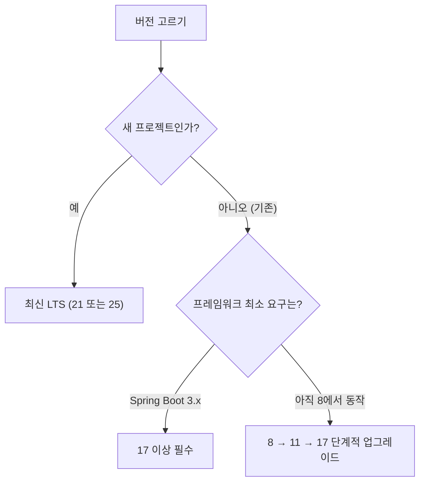

# 한 줄 요약

기준은 **두 가지**다 — **"LTS인가"** 그리고 **"내 프레임워크가 요구하는 최소 버전이 뭐냐"**. 새 프로젝트는 **최신 LTS**, 기존 프로젝트는 **8 → 11 → 17** 순으로 단계적으로 올린다.

<aside class="callout callout--note"><span class="callout-icon" aria-hidden="true">🎯</span><div class="callout-body"><p><strong>결론 먼저:</strong> 고민되면 <strong>최신 LTS</strong>를 고른다. 자바 8은 이제 <strong>"새로 시작할 버전"이 아니라 기존 시스템을 유지하는 버전"</strong> 이다.</p></div></aside>

# 1. 먼저 알아야 할 것 — LTS

자바는 **6개월마다** 새 버전이 나온다. 하지만 대부분은 **6개월짜리**다.

- **LTS(Long-Term Support)** 만 장기간 보안 패치를 받는다.

- 비LTS는 다음 버전이 나오면 지원이 끊긴다 → **실무에선 LTS만 쓴다.**

- 지금까지의 LTS: **8 · 11 · 17 · 21 · 25**

<aside class="callout callout--tip"><span class="callout-icon" aria-hidden="true">💡</span><div class="callout-body"><p><strong>"1.8"과 "8"은 같은 것이다.</strong> 예전엔 <code>1.8</code> 처럼 적었고, 자바 9부터는 그냥 <code>9</code>, <code>11</code>, <code>17</code>로 부른다. 그래서 <code>java -version</code>이 <code>1.8.0_xxx</code>라면 <strong>자바 8</strong>이다.</p></div></aside>

# 2. 버전별로 뭐가 생겼나 (핵심만)

각 LTS 시점에 **쓸 수 있게 된 것** 위주로.

<div class="table-wrap"><table><tr><th>버전</th><th>시기</th><th>대표적으로 생긴 것</th></tr><tr><td><strong>8 (1.8)</strong></td><td>2014</td><td>람다, 스트림(Stream), <code>Optional</code>, 새 날짜 API(<code>java.time</code>)</td></tr><tr><td><strong>11</strong></td><td>2018</td><td>표준 <code>HttpClient</code>, <code>String</code> 편의 메서드(<code>isBlank</code>·<code>strip</code>·<code>repeat</code>), 지역변수 <code>var</code>(10 도입)</td></tr><tr><td><strong>17</strong></td><td>2021</td><td><code>record</code>, <code>sealed</code>, <code>switch</code> 표현식, 텍스트 블록, <code>instanceof</code> 패턴 매칭</td></tr><tr><td><strong>21</strong></td><td>2023</td><td><strong>가상 스레드(Virtual Threads)</strong>, <code>switch</code> 패턴 매칭, 순차 컬렉션</td></tr><tr><td><strong>25</strong></td><td>2025</td><td>최신 LTS</td></tr></table></div>

<aside class="callout callout--note"><span class="callout-icon" aria-hidden="true">📌</span><div class="callout-body"><p>체감상 가장 큰 분기점은 <strong>8 → 17</strong>과 <strong>21</strong>이다. 17에서 코드가 확 간결해지고(<code>record</code>·<code>switch</code> 표현식), 21의 <strong>가상 스레드</strong>는 동시성 처리 방식 자체를 바꿔놓았다.</p></div></aside>

# 3. 어떻게 고르나



- **새 프로젝트** → 고민할 이유 없이 **최신 LTS**. 생태계·라이브러리도 다 따라왔다.

- **Spring Boot 3.x를 쓴다** → **자바 17이 최소 요구**다. 선택의 여지가 없다.

- **기존 8 프로젝트** → 한 번에 점프하지 말고 **8 → 11 → 17** 순서로.

# 4. 예제 — 버전 확인과 고정

```bash
java -version
# 1.8.0_392 → 자바 8
# 17.0.9    → 자바 17
```

빌드 도구에서 **버전을 명시적으로 고정**해두는 게 안전하다.

```groovy
// build.gradle
java {
  toolchain {
    languageVersion = JavaLanguageVersion.of(21)
  }
}
```

<details class="toggle"><summary>왜 버전을 고정하나?</summary><div class="toggle-body"><p>개발자마다 설치된 JDK가 달라서 <strong>"내 PC에선 되는데 빌드 서버에선 안 된다"</strong> 가 생긴다. 툴체인(toolchain)으로 고정하면 빌드가 지정된 JDK를 쓰도록 보장된다.</p></div></details>

# 5. 업그레이드할 때 걸리는 것들

버전을 올릴 때 실제로 부딪히는 벽들이다.

<div class="table-wrap"><table><tr><th>벽</th><th>내용</th></tr><tr><td><strong>javax → jakarta</strong></td><td>가장 큰 벽. Spring Boot 3·Jakarta EE 9+부터 <strong>패키지 이름이 바뀌어</strong> import를 전부 고쳐야 한다</td></tr><tr><td><strong>제거된 모듈</strong></td><td>11에서 JAXB 등 Java EE 모듈이 빠졌다 → 의존성을 따로 추가해야 함</td></tr><tr><td><strong>내부 API 차단</strong></td><td>17부터 JDK 내부 API 접근이 막혔다 → 오래된 라이브러리가 깨질 수 있음</td></tr><tr><td><strong>라이브러리 호환</strong></td><td>오래된 의존성이 새 JDK를 지원 안 할 수 있다 → 버전부터 올린다</td></tr></table></div>

# 6. 함정과 방지책

<aside class="callout callout--warn"><span class="callout-icon" aria-hidden="true">🧨</span><div class="callout-body"><p><strong>함정 1 — 비LTS를 실무에 쓴다.</strong> 예: 19·22 같은 버전은 6개월 뒤 보안 패치가 끊긴다.</p><p><strong>방지:</strong> 실무 서비스는 <strong>LTS만</strong>(8·11·17·21·25).</p></div></aside>

<aside class="callout callout--warn"><span class="callout-icon" aria-hidden="true">🧨</span><div class="callout-body"><p><strong>함정 2 — "잘 돌아가니까" 8에 계속 머문다.</strong> 미뤄둘수록 건너야 할 버전이 쌓여 <strong>나중에 더 비싸게</strong> 먹힌다. 새 라이브러리도 점점 8을 버린다.</p><p><strong>방지:</strong> 급하지 않을 때 <strong>계획적으로</strong> 11 → 17로 올린다.</p></div></aside>

<aside class="callout callout--warn"><span class="callout-icon" aria-hidden="true">🧨</span><div class="callout-body"><p><strong>함정 3 — 8에서 21로 한 번에 점프.</strong> 바뀐 게 너무 많아 어디서 문제가 발생하는지 찾기 어렵다.</p><p><strong>방지:</strong> 한 단계씩 올리고 매번 테스트를 돌린다.</p></div></aside>

<aside class="callout callout--warn"><span class="callout-icon" aria-hidden="true">🧨</span><div class="callout-body"><p><strong>함정 4 — 빌드와 런타임 버전 불일치.</strong> 17로 빌드해놓고 서버엔 8이 깔려 있으면 실행 시점에 터진다.</p><p><strong>방지:</strong> 툴체인으로 고정하고, 배포 환경(도커 이미지 등)의 JDK 버전을 맞춘다.</p></div></aside>

# 7. 정리하자면

<aside class="callout callout--note"><span class="callout-icon" aria-hidden="true">🙋</span><div class="callout-body"><p>우리도 새로운 기술에 맞춰가듯 계속 학습하는 것처럼 옛날 시스템은 최대한 업그레이드를 하는 시간도 중요하다 생각이 든다. 하지만 보통의 회사들은 버전을 올리는 걸 정말 꺼려하는 것이 느껴진다.. 시간도.. 비용도..</p></div></aside>
