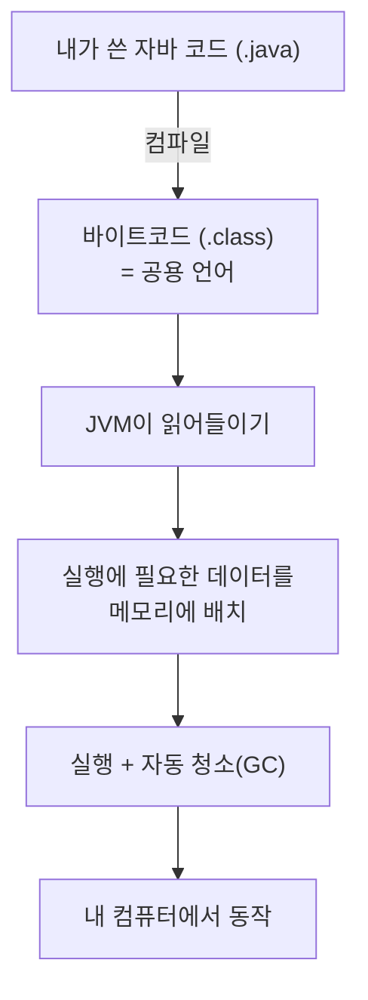
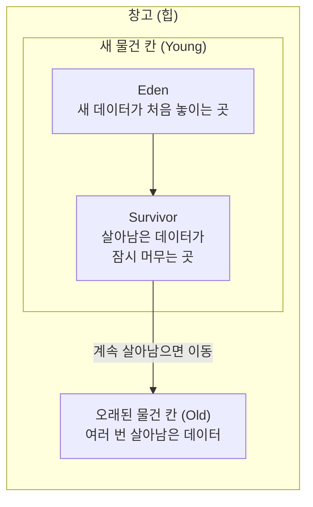
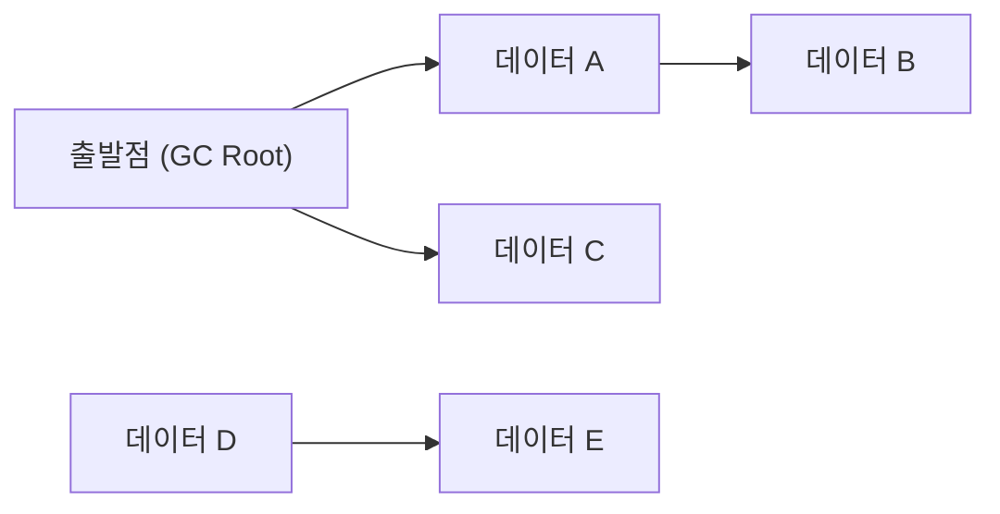

# 한 줄 요약

JVM(Java Virtual Machine)은 자바 코드를 **어느 컴퓨터에서든 똑같이 실행해주는 프로그램**이고, GC(Garbage Collector)는 실행 중에 **더 이상 안 쓰게 된 데이터를 알아서 치워주는 자동 청소 기능**이다.

<aside class="callout callout--note"><span class="callout-icon" aria-hidden="true">🎯</span><div class="callout-body"><p>쉽게 말하면: <strong>JVM은 "번역 겸 실행 담당", GC는 "뒤에서 조용히 치워주는 청소 담당"</strong> 이다. 둘 다 우리가 직접 신경 쓰지 않아도 자바가 알아서 돌아가게 해준다.</p></div></aside>

# 1. 왜 알아두면 좋을까

자바는 메모리를 자동으로 관리해줘서 평소엔 몰라도 코딩이 된다. 하지만 아래 상황이 오면 이 원리를 아는 사람과 모르는 사람의 차이가 크게 벌어진다.

- **앱이 느려질 때** — 청소(GC)하는 동안 프로그램이 잠깐 멈추는데, 이게 잦으면 앱이 버벅인다.

- **앱이 뻗을 때** — `OutOfMemoryError`(메모리 부족)가 왜 났는지 추적하려면 데이터가 어디에 쌓이는지 알아야 한다.

- **성능을 높이고 싶을 때** — 메모리 크기나 청소 방식을 상황에 맞게 골라줄 수 있다.

<aside class="callout callout--warn"><span class="callout-icon" aria-hidden="true">⚠️</span><div class="callout-body"><p>자동 청소가 있다고 메모리 문제가 사라지는 건 아니다. <strong>누군가 데이터를 계속 붙잡고 있으면(쓰겠다고 표시해두면) 청소부는 그걸 절대 못 버린다.</strong> 이게 자바 메모리 문제의 핵심이다.</p></div></aside>

# 2. JVM이 하는 일 (큰 그림)

자바 코드는 곧바로 실행되지 않는다. 먼저 **바이트코드**라는 중간 형태로 바뀐다. 바이트코드는 "여러 컴퓨터에서 공통으로 통하는 언어"라고 보면 된다. JVM은 이 공용 언어를 각 컴퓨터가 알아듣는 말로 통역하며 실행해준다. 그래서 자바는 *한 번 만들면 어디서든 실행*이 가능하다.



JVM이 하는 일은 크게 세 가지다.

- **읽어들이기** — 바이트코드 파일을 메모리에 올리고, 문제가 없는지 검사한다.

- **저장 공간 관리** — 실행 중 만들어지는 데이터를 메모리에 나눠 담는다. (3장)

- **실행 + 청소** — 코드를 실제로 돌리면서, 안 쓰는 데이터를 GC가 치운다. (4~5장)

# 3. 실행 중 데이터는 어디에 저장될까

프로그램이 돌아가는 동안 만들어지는 데이터는 성격에 따라 다른 공간에 담긴다. 지금은 **두 곳만** 기억하면 충분하다.

<div class="table-wrap"><table><tr><th>공간</th><th>담기는 것</th><th>비유</th></tr><tr><td><strong>힙 (Heap)</strong></td><td><code>new</code>로 만든 모든 데이터(객체). <strong>청소부 GC의 주 무대.</strong></td><td>물건을 쌓아두는 창고</td></tr><tr><td><strong>스택 (Stack)</strong></td><td>지금 실행 중인 함수의 지역 변수, "그 데이터를 가리키는 이름표".</td><td>지금 하는 일을 적는 메모지</td></tr></table></div>

<aside class="callout callout--tip"><span class="callout-icon" aria-hidden="true">💡</span><div class="callout-body"><p><strong>데이터 본체는 창고(힙)에, 그걸 가리키는 이름표는 메모지(스택)에.</strong> 예를 들어 <code>User u = new User()</code>에서 진짜 <code>User</code> 데이터는 힙에 놓이고, <code>u</code>는 그걸 가리키는 이름표일 뿐이다. 함수가 끝나 메모지가 버려지면 이름표도 사라지고, 아무도 안 가리키게 된 창고 속 데이터가 청소 대상이 된다.</p></div></aside>

<details class="toggle"><summary>더 있는 저장 공간 (당장은 몰라도 됨)</summary><div class="toggle-body"><ul><li><strong>Metaspace</strong> — 클래스의 설계도 정보가 담기는 곳. (자바 8부터 위치가 바뀜)</li><li><strong>PC Register / Native Method Stack</strong> — 실행 위치 표시, 자바 밖(C/C++) 함수 호출용 공간. 아주 내부적인 영역이라 입문 단계에선 넘어가도 된다.</li></ul></div></details>

# 4. 창고(힙)는 '새 물건'과 '오래된 물건' 칸으로 나뉜다

힙은 다시 **Young(새 물건 칸)** 과 **Old(오래된 물건 칸)** 으로 나뉜다. 왜 굳이 나눌까? 경험에서 나온 규칙 때문이다.

<aside class="callout callout--note"><span class="callout-icon" aria-hidden="true">📌</span><div class="callout-body"><p><strong>대부분의 데이터는 금방 안 쓰게 되고, 오래 살아남은 데이터는 앞으로도 계속 쓰인다.</strong> 그래서 청소부는 "금방 버려질 새 물건 칸"만 자주, 빠르게 치우고, 오래된 물건 칸은 가끔만 치운다. 효율을 위한 분리다.</p></div></aside>



새 데이터는 먼저 **Eden**에 놓인다. 청소를 몇 번 겪고도 살아남으면 **Survivor**를 거쳐, 계속 살아남는 "장수 데이터"는 **Old 칸**으로 옮겨진다.

# 5. GC가 청소하는 방법

## 5-1. 무엇이 '쓰레기'일까 — "손이 닿느냐"

청소부 GC는 "이 데이터를 몇 명이 쓰나"를 세지 않는다. 대신 **출발점(GC Root)에서 이름표를 따라갔을 때 손이 닿는지**만 본다. 손이 닿으면 살리고, 안 닿으면 쓰레기로 본다. 출발점의 예: 지금 실행 중인 함수의 변수, 프로그램 전체가 공유하는 값 등.



위에서 A·B·C는 출발점에서 손이 닿아 **살아남고**, D·E는 서로를 가리키지만 출발점에서 닿지 않아 **함께 치워진다.** (서로만 붙잡고 있어도 소용없다는 점이 핵심이다.)

## 5-2. 표시하고 → 치우고 → 정리하기

대부분의 청소는 이 3단계다.

1. **표시(Mark)** — 출발점부터 따라가며 살아있는 데이터에 표시한다.

1. **치우기(Sweep)** — 표시 안 된 데이터(쓰레기)를 버린다.

1. **정리(Compact)** — 남은 데이터를 한쪽으로 모아 빈 공간을 이어붙인다.

## 5-3. 작은 청소 vs 큰 청소

<div class="table-wrap"><table><tr><th>구분</th><th>치우는 곳</th><th>빈도 / 속도</th></tr><tr><td><strong>작은 청소 (Minor GC)</strong></td><td>새 물건 칸 (Young)</td><td>자주 / 빠름</td></tr><tr><td><strong>큰 청소 (Full GC)</strong></td><td>창고 전체</td><td>드물게 / 느림</td></tr></table></div>

<aside class="callout callout--warn"><span class="callout-icon" aria-hidden="true">🛑</span><div class="callout-body"><p><strong>청소할 땐 잠깐 멈춘다 (Stop-The-World).</strong> 창고를 정확히 치우려면, 청소하는 잠깐 동안 프로그램을 멈춰야 하는 순간이 있다. 이 멈춤이 길면 앱이 버벅인다. 그래서 요즘 청소부들의 목표는 <strong>이 멈춤을 최대한 짧게</strong> 만드는 것이다.</p></div></aside>

# 6. 청소부(GC)에도 종류가 있다

상황에 따라 청소 방식을 고를 수 있다. **일을 많이 처리하는 게 중요한지(처리량)**, **멈춤이 짧은 게 중요한지(지연시간)** 가 기준이다.

<div class="table-wrap"><table><tr><th>종류</th><th>특징</th><th>언제 좋은가</th></tr><tr><td><strong>Serial</strong></td><td>청소부 한 명. 단순함.</td><td>작은 프로그램</td></tr><tr><td><strong>Parallel</strong></td><td>청소부 여러 명. 많이 처리.</td><td>처리량이 중요할 때</td></tr><tr><td><strong>G1</strong> (요즘 기본값)</td><td>창고를 구역으로 쪼개, 멈춤 시간을 목표치로 관리.</td><td>대부분의 일반 서버</td></tr><tr><td><strong>ZGC / Shenandoah</strong></td><td>멈춤을 극단적으로 짧게(수 밀리초 이하).</td><td>아주 큰 메모리 + 멈춤이 치명적일 때</td></tr></table></div>

<aside class="callout callout--note"><span class="callout-icon" aria-hidden="true">📎</span><div class="callout-body"><p>특별히 설정하지 않으면 요즘 자바는 <strong>G1</strong>을 기본으로 쓴다. 입문 단계에선 "종류가 여러 개 있고, 상황 따라 고른다" 정도만 알면 충분하다.</p></div></aside>

# 7. 눈으로 확인하기 — GC 로그

실행할 때 옵션을 켜면, 청소부가 언제 얼마나 치웠는지 로그로 볼 수 있다.

```bash
# 메모리 최대 512MB, GC 로그 켜기
java -Xmx512m -Xlog:gc -jar app.jar
```

```plain text
GC(0) Pause Young 24M->5M(256M) 3.412ms
```

<details class="toggle"><summary>이 로그 한 줄, 쉽게 풀어보기</summary><div class="toggle-body"><ul><li><code>GC(0)</code> — 첫 번째 청소</li><li><code>Pause Young</code> — 새 물건 칸(Young)을 치운 작은 청소</li><li><code>24M-&gt;5M(256M)</code> — 청소 전 24MB 쓰던 게 → 5MB로 줄었다 (전체 256MB 중)</li><li><code>3.412ms</code> — 이번에 멈춘 시간</li></ul><p>즉 <strong>19MB어치 쓰레기를 3.4밀리초 만에 치웠다</strong>는 뜻이다.</p></div></details>

# 8. 초보가 흔히 빠지는 함정

<aside class="callout callout--warn"><span class="callout-icon" aria-hidden="true">🧨</span><div class="callout-body"><p><strong>함정 1 — 안 쓰는데도 이름표를 안 뗌 (메모리 누수).</strong> 프로그램 전체가 공유하는 목록(예: <code>static</code> 리스트)에 데이터를 계속 넣고 빼지 않으면, 출발점에서 영원히 손이 닿아 청소가 안 된다. 결국 메모리가 꽉 찬다.</p><p><strong>해결:</strong> 다 쓴 데이터는 목록에서 직접 빼준다.</p></div></aside>

<aside class="callout callout--warn"><span class="callout-icon" aria-hidden="true">🧨</span><div class="callout-body"><p><strong>함정 2 — </strong><code>System.gc()</code><strong>로 억지 청소.</strong> "지금 당장 치워!"라고 강제로 부르면 오히려 큰 청소가 일어나 더 오래 멈춘다.</p><p><strong>해결:</strong> 부르지 않는다. 청소 시점은 자바에 맡긴다.</p></div></aside>

<aside class="callout callout--warn"><span class="callout-icon" aria-hidden="true">🧨</span><div class="callout-body"><p><strong>함정 3 — 메모리만 키우면 된다는 착각.</strong> 창고(<code>-Xmx</code>)를 무작정 키우면, 한 번 큰 청소할 때 멈추는 시간이 오히려 더 길어질 수 있다.</p><p><strong>해결:</strong> 멈춤이 중요하면 크기보다 <strong>청소부 종류 선택</strong>(G1 등)이 먼저다.</p></div></aside>

# 9. 내가 다시 설명한다면

<aside class="callout callout--note"><span class="callout-icon" aria-hidden="true">🙋</span><div class="callout-body"><p><em>(직접 정리한 생각)</em> <strong>JVM과 GC는 CPU와 메모리(램)처럼 서로 뗄 수 없는 짝꿍 같다.</strong> 어느 한쪽만으로는 성능이 나지 않고, 둘이 맞물려 돌아가야 한다. 연산 능력을 조금이라도 끌어올리려면 결국 이 둘을 어떻게 최적화하느냐가 관건이라, JVM·GC는 자바 성능의 필수 요소라고 느껴진다.</p></div></aside>
