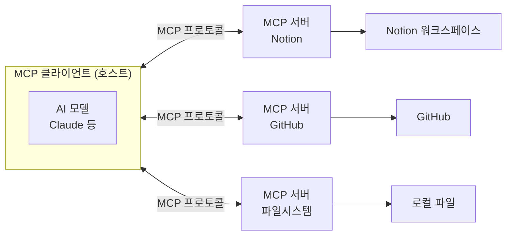
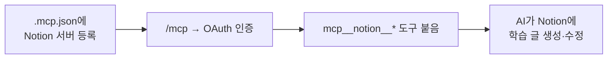

# 한 줄 요약

MCP(Model Context Protocol)는 **AI 어시스턴트를 외부 도구·데이터에 연결하는 공통 표준**이다. 서비스마다 문법이 달라 일일이 맞추던 연동을, 하나의 규격으로 통일한 것이다.

<aside class="callout callout--note">🎯

쉽게 말하면: <strong>MCP는 'AI를 위한 USB-C 포트'</strong>다. 예전엔 기기마다 케이블이 달랐지만, USB-C로 통일되자 아무 기기나 포트에 꿂만 하면 통하듯— MCP를 말하는 AI 앱과 도구라면 서로 그냥 연결된다.

</aside>

# 1. 왜 등장했나

AI가 혼자 대답만 하던 시절엔 문제가 없었다. 하지만 AI가 **실제 일(내 Notion에 글 쓰기, GitHub에 커밋, DB 조회)** 을 하려면 외부 시스템과 연결되어야 한다.

그런데 서비스마다 API·인증 방식이 제각각이라, "AI × 도구" 조합마다 연동을 새로 만들어야 했다.

<aside class="callout callout--warn">⚠️

<strong>MCP 이전 = M×N 문제.</strong> AI 앱 M개 × 도구 N개를 각각 이으려면 M×N개의 연동이 필요했다. <strong>MCP는 공통 규격으로 이걸 M+N으로 줄였다.</strong>

</aside>

# 2. 큰 그림 — 클라이언트 ↔ 서버

MCP에는 두 역할이 있다.

- **MCP 클라이언트(호스트)** — 도구를 불러 쓰는 쪽. Claude Code, Claude Desktop, IDE 등.

- **MCP 서버** — 도구·데이터를 "제공하는" 쪽. Notion·GitHub·DB 등 각 서비스마다 하나씩.

# 3. 서버가 제공하는 3가지

MCP 서버는 세 종류의 기능을 제공한다.

<table><tr><th>종류</th><th>무엇인가</th><th>예</th></tr><tr><td><strong>Tools (도구)</strong></td><td>모델이 호출하는 '행동'</td><td>페이지 생성, 검색, 커밋</td></tr><tr><td><strong>Resources (리소스)</strong></td><td>읽어오는 '데이터·맥락'</td><td>파일 내용, DB 스키마</td></tr><tr><td><strong>Prompts (프롬프트)</strong></td><td>재사용 템플릿</td><td>정형화된 요청 양식</td></tr></table>

<aside class="callout callout--tip">💡

가장 많이 쓰는 건 <strong>Tools</strong>다. 내가 학습을 정리해둔 공부 아카이브 사이트도 Notion 서버가 내놓아준 <code>notion-create-pages</code>·<code>notion-search</code> 같은 Tool로 학습 글을 만들었다.

</aside>

# 4. 연결 방식 — 로컬 vs 원격

서버가 어디서 환경이 구성되는지에 따라 두 가지다.

<table><tr><th>방식</th><th>설명</th><th>인증</th></tr><tr><td><strong>로컬 (stdio)</strong></td><td>내 PC에서 서버 프로그램을 프로세스로 실행</td><td>보통 로컬 권한/env</td></tr><tr><td><strong>원격 (HTTP)</strong></td><td>호스팅된 서버에 접속</td><td>보통 OAuth 로그인</td></tr></table>

<aside class="callout callout--note">📌

이 프로젝트의 Notion 연동이 바로 <strong>원격(HTTP) + OAuth</strong> 방식이다. 그래서 처음에 <code>/mcp</code>로 브라우저 로그인을 했고, 토큰은 따로 저장되어 설정 파일엔 URL만 남는다.

</aside>

# 5. Claude Code에서 쓰는 법

- **등록** — `.mcp.json`(프로젝트용) 또는 `claude mcp add ...`

- **관리·인증** — 대화형에서 `/mcp` (연결 상태 확인, OAuth 로그인)

- **범위(scope) 3가지**

<table><tr><th>scope</th><th>적용 범위</th></tr><tr><td>local</td><td>나만, 이 머신</td></tr><tr><td>project</td><td><code>.mcp.json</code>로 팀 공유 가능</td></tr><tr><td>user</td><td>내 모든 프로젝트</td></tr></table>

# 6. 예제 — 이 프로젝트의 Notion 연동

실제로 이 학습 아카이브가 MCP를 쓰는 흐름이다.

1. `.mcp.json`에 Notion MCP 서버(URL) 등록.

1. `/mcp`로 OAuth 인증 → 서버 연결.

1. `notion-create-pages` 같은 도구가 붙음.

1. 그 도구로 AI가 Notion에 글을 만들고, 사람이 검수 후 발행.

# 7. 함정과 방지책

<aside class="callout callout--warn">🧨

<strong>함정 1 — 서버를 마구잡이 많이 켜기.</strong> 서버마다 도구가 늘고, 도구가 많으면 <strong>토큰·컨텍스트 비용</strong>이 커진다.

<strong>방지:</strong> 필요한 서버만 켜고, 안 쓰면 꺼야한다.

</aside>

<aside class="callout callout--warn">🧨

<strong>함정 2 — 설정 파일에 비밀값 넣기.</strong> <code>.mcp.json</code>에 토큰·키를 직접 적으면 유출 위험.

<strong>방지:</strong> OAuth 방식은 토큰이 별도 저장되어 URL만 남으므로 안전. 로컬 서버는 env·시크릿으로 주입.

</aside>

<aside class="callout callout--warn">🧨

<strong>함정 3 — 도구가 가져온 내용을 '명령'으로 믿기(프롬프트 인젝션).</strong> 웹페이지·문서에 몰래 적힌 지시를 AI가 그대로 실행하면 위험.

<strong>방지:</strong> 도구가 가져온 외부 내용은 '명령'이 아니라 '데이터'로 취급한다.

</aside>

<aside class="callout callout--warn">🧨

<strong>함정 4 — 아무 서버나 신뢰하기.</strong> 서버는 내 데이터를 읽고 행동할 수 있다.

<strong>방지:</strong> 공식·검증된 서버 위주로, 그 서버가 어떤 도구를  제공하는지 확인하고 최소 권한으로.

</aside>

# 8. 정리하자면

<aside class="callout callout--note">🙋

MCP는 Claude Code를 Vibe Coding 하기 위해서만 사용하는 것을 넘어 현재 이미 나와있는 서비스와의 확장성을 고려하여 AI를 더욱 넓은 범위로 다양하게 사용하기 위한 필수 요소이다.

</aside>
