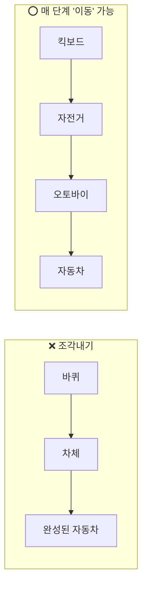
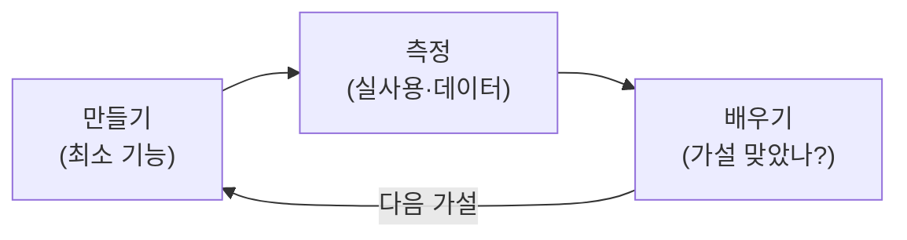

# 한 줄 요약

MVP(Minimum Viable Product)는 **가장 적은 기능으로 빨리 만들어**, "이 제품이 정말 필요한가"를 **실제 사용자로 검증**하는 가장 작은 제품이다. 핵심은 기능을 줄이는 게 아니라 **가설을 검증**하는 것이다.

<aside class="callout callout--note">🎯

한 줄로: <strong>"완성품을 늦게 내는 것"이 아니라, "가장 중요한 질문 하나를 가장 빨리 확인하는 것".</strong> MVP는 제품이라기보다 <strong>실험</strong>에 가깝다.

</aside>

# 1. 왜 중요한가

제품을 만드는 가장 큰 위험은 **"아무도 안 쓰는 걸 오래 만드는 것"**이다.

- 몇 달간 기능을 가득 넣어 출시했는데 아무도 안 쓴다면, 그 시간이 통 낭비다.

- MVP는 **가장 빨리 현실의 피드백**을 받아, 큰 돈·시간을 쓰기 전에 방향을 잡게 해준다.

- "내 생각에 좋은 제품"과 "시장이 원하는 제품"은 다를 수 있다. MVP는 그 간극을 일찍 줄인다.

<aside class="callout callout--warn">⚠️

<strong>MVP의 M은 'Minimum'이지만, V(Viable, 쓸 만한)도 빼면 안 된다.</strong> 너무 부족해 제대로 검증도 못 하면 MVP가 아니라 그냥 미완성품이다.

</aside>

# 2. 핵심 오해 풀기 — 바퀴를 쓰되, 조각내지 마라

가장 유명한 그림이다. **"이동 수단"이 목표일 때**, 바퀴부터 만들면 중간에 쓸 수 없다.

- **조각내기(위)**: 바퀴 → 차체 → … 완성 전까지 **아무것도 못 한다.** 피드백도 없다.

- **MVP(아래)**: 매 단계가 비록 작아도 **지금 당장 "이동"이라는 핵심 가치**를 준다. 쓰면서 배운다.

<aside class="callout callout--tip">💡

즉 MVP는 "완성품의 일부"가 아니라 <strong>"지금 바로 핵심 가치를 주는, 가장 간단한 형태"</strong>다. 킥보드도 "이동"이라는 가치를 준다.

</aside>

# 3. 만드는 흐름 — 만들고·재고·배우기

MVP는 한 번 만들고 끝이 아니라 **반복 루프**의 한 바퀴다.

1. **가설 정의** — "사용자는 X 때문에 이 제품을 쓸 것이다"를 명확히.

1. **만들기** — 그 가설을 확인할 **최소 기능만**.

1. **측정** — 진짜 사용자가 쓰는지 데이터로 본다.

1. **배우기** — 맞았으면 확장(지속), 틀렸으면 방향 수정(피봇).

# 4. 예제 — 같은 아이디어, 두 가지 접근

"지역 중고거래 앱"을 만든다고 하자.

<table><tr><th>구분</th><th>❌ 큰 출시</th><th>⭕ MVP</th></tr><tr><td>범위</td><td>결제·채팅·리뷰·지도 전부</td><td>글 올리기 + 연락처 교환만</td></tr><tr><td>기간</td><td>6개월</td><td>2주</td></tr><tr><td>확인하는 것</td><td>(출시 후에야 안다)</td><td>"사람들이 지역 거래를 원하는가?"</td></tr></table>

<aside class="callout callout--note">📌

실제 사례: 백엔드를 거의 안 만들고 <strong>사람이 수동으로 처리</strong>하는 MVP도 많다(예: 주문을 관리자가 손으로 넣기). "수요가 있는가"만 먼저 확인하고, 자동화는 검증 뒤에 한다.

</aside>

# 5. 함정과 방지책

<aside class="callout callout--warn">🧨

<strong>함정 1 — 기능을 계속 붙인다.</strong> "이거만 더 넣고"가 쌓이면 MVP가 아니라 그냥 느린 출시가 된다.

<strong>방지:</strong> "이 기능이 없으면 가설을 검증 못 하나?"를 기준으로 자른다.

</aside>

<aside class="callout callout--warn">🧨

<strong>함정 2 — 품질을 포기하고 MVP라 부른다.</strong> 간단한 것과 허술한 것은 다르다. 버그투성이면 가설이 아니라 제품이 싫어진 건지 알 수 없다.

<strong>방지:</strong> 범위는 좁히되 그 범위 안에서는 쓸 만하게 만든다.

</aside>

<aside class="callout callout--warn">🧨

<strong>함정 3 — 측정 지표 없이 만든다.</strong> 뭐를 보고 "성공/실패"를 판단할지 안 정하면, 만들고도 배우는 게 없다.

<strong>방지:</strong> 만들기 전에 <strong>성공 지표(예: 가입률·재방문)</strong> 를 먼저 정한다.

</aside>
