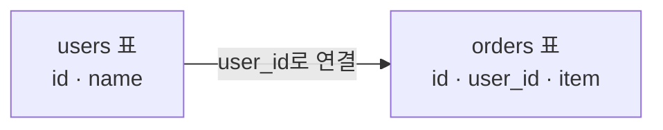

# 한 줄 요약

**관계형 DB(RDB)** 는 정해진 **표(테이블)** 에 데이터를 나눠 담고 서로 **관계로 이어주는** 방식이고, **NoSQL**은 그 틀을 느슨하게 풀어 **유연함·확장성**을 얻은 방식이다. 어느 쪽이 우월한 게 아니라 **데이터 모양과 요구사항에 따라 고르는** 문제다.

<aside class="callout callout--note"><span class="callout-icon" aria-hidden="true">🎯</span><div class="callout-body"><p>비유: RDB는 <strong>칸이 정해진 서류 캐비닛</strong>(엑셀 표처럼 양식이 고정), NoSQL은 <strong>필요한 걸 통째로 담는 상자</strong>(상자마다 내용물이 달라도 됨).</p></div></aside>

# 1. 왜 중요한가

저장 방식 선택은 **되돌리기 가장 어려운 결정** 중 하나다.

- 나중에 바꾸려면 데이터 이사(마이그레이션) 비용이 크다.

- 서비스 특성에 따라 **성능·확장성·정확성**이 갈린다.

- 면접·설계 논의에서 항상 나오는 기본기다.

# 2. 관계형 DB (RDB)

데이터를 **여러 표로 나눠** 저장하고, 필요할 때 **이어 붙여(JOIN)** 본다.



- **스키마 고정** — 어떤 칸이 있고 어떤 타입인지 미리 정한다.

- **정규화** — 같은 데이터를 중복 저장하지 않고 쪼개서 보관한다.

- **관계** — 외래 키로 표끼리 연결하고 JOIN으로 조합한다.

- **ACID 트랜잭션** — 돈 계산처럼 "중간에 깨지면 안 되는" 작업을 안전하게 묶어준다.

- 예: MySQL, PostgreSQL, Oracle, H2

<aside class="callout callout--tip"><span class="callout-icon" aria-hidden="true">💡</span><div class="callout-body"><p><strong>ACID</strong> = 전부 되거나 전부 안 되거나(Atomicity), 규칙이 깨지지 않고(Consistency), 동시에 해도 서로 안 섞이고(Isolation), 한번 저장되면 남는다(Durability). <strong>송금이 대표 예</strong>다 — 출금만 되고 입금이 안 되면 큰일.</p></div></aside>

# 3. NoSQL

이름은 "Not Only SQL" — **표 형태만 고집하지 않겠다**는 뜻이다. 하나의 기술이 아니라 **종류가 여럿**이라는 게 핵심이다.

<div class="table-wrap"><table><tr><th>종류</th><th>어떻게 담나</th><th>대표 · 쓰임새</th></tr><tr><td><strong>문서(Document)</strong></td><td>JSON 같은 문서를 통째로</td><td>MongoDB · 구조가 유연한 데이터</td></tr><tr><td><strong>키-값(Key-Value)</strong></td><td>키로 값을 바로 꺼냄</td><td>Redis · 캐시, 세션</td></tr><tr><td><strong>와이드 컬럼</strong></td><td>행 단위로 엄청 많은 컬럼</td><td>Cassandra · 대용량 로그</td></tr><tr><td><strong>그래프(Graph)</strong></td><td>점과 선(관계) 자체를 저장</td><td>Neo4j · 친구·추천 관계 탐색</td></tr></table></div>

# 4. 핵심 차이 한눈에

<div class="table-wrap"><table><tr><th>항목</th><th>관계형 DB</th><th>NoSQL</th></tr><tr><td>스키마</td><td>미리 고정</td><td>유연(데이터마다 달라도 됨)</td></tr><tr><td>데이터 배치</td><td>쪼개서 저장(정규화) + JOIN</td><td>자주 같이 쓰는 걸 <strong>한 덩어리</strong>로</td></tr><tr><td>확장</td><td>주로 수직(서버 성능 올리기)</td><td>수평(서버 개수 늘리기)에 유리</td></tr><tr><td>트랜잭션</td><td>ACID가 강함</td><td>제품마다 다름(전통적으로 느슨)</td></tr><tr><td>강점</td><td>정확성 · 복잡한 관계</td><td>유연함 · 대용량 · 빠른 조회</td></tr></table></div>

# 5. 예제 — 같은 데이터를 다르게 담기

"진환이 키보드와 모니터를 샀다"를 각각 이렇게 저장한다.

**관계형** — 나눠 담고 필요할 때 합친다.

```sql
SELECT u.name, o.item
FROM users u
JOIN orders o ON o.user_id = u.id
WHERE u.id = 1;
```

**문서형 NoSQL** — 애초에 한 덩어리로 담는다.

```json
{
  "_id": 1,
  "name": "진환",
  "orders": [
    { "item": "키보드" },
    { "item": "모니터" }
  ]
}
```

<aside class="callout callout--note"><span class="callout-icon" aria-hidden="true">📌</span><div class="callout-body"><p><strong>이 한 장이 차이의 전부다.</strong> RDB는 중복 없이 <strong>나눠 두고 필요할 때 합친다</strong>(JOIN). NoSQL은 <strong>자주 같이 쓰는 걸 미리 붙여</strong> 한 번에 꺼낸다 — 조회는 빠르지만 <strong>중복이 생긴다.</strong></p></div></aside>

# 6. 어떻게 고르나

<div class="table-wrap"><table><tr><th>상황</th><th>선택</th></tr><tr><td>돈·재고처럼 <strong>정확성</strong>이 중요</td><td>관계형 DB</td></tr><tr><td>데이터 구조가 제각각·자주 바뀜</td><td>문서 DB</td></tr><tr><td>캐시·세션처럼 빠른 조회</td><td>키-값(Redis)</td></tr><tr><td>관계 탐색 자체가 핵심(추천·친구)</td><td>그래프 DB</td></tr><tr><td>대용량 로그 쓰기</td><td>와이드 컬럼</td></tr></table></div>

<aside class="callout callout--note"><span class="callout-icon" aria-hidden="true">📌</span><div class="callout-body"><p>실전 패턴: <strong>대부분의 웹 서비스는 관계형 DB로 시작해도 충분하다.</strong> 그리고 필요한 곳에만 곁들인다(예: 캐시는 Redis). </p></div></aside>

# 7. 함정과 방지책

<aside class="callout callout--warn"><span class="callout-icon" aria-hidden="true">🧨</span><div class="callout-body"><p><strong>함정 1 — "NoSQL이 최신이니 더 좋다".</strong> 둘은 <strong>목적이 다른</strong> 도구다. 관계가 복잡하거나 정확성이 중요하면 RDB가 맞다.</p><p><strong>방지:</strong> 기술 유행이 아니라 <strong>데이터 모양과 조회 패턴</strong>으로 고른다.</p></div></aside>

<aside class="callout callout--warn"><span class="callout-icon" aria-hidden="true">🧨</span><div class="callout-body"><p><strong>함정 2 — NoSQL을 RDB처럼 쓴다.</strong> 여러 컬렉션을 따로 조회해 직접 이어붙이면 오히려 느리다.</p><p><strong>방지:</strong> "어떤 화면에서 어떻게 조회할지"를 먼저 정하고, 그에 맞춰 문서를 설계한다.</p></div></aside>

<aside class="callout callout--warn"><span class="callout-icon" aria-hidden="true">🧨</span><div class="callout-body"><p><strong>함정 3 — 중복 갱신을 빼먹는다.</strong> 한 덩어리로 묶으면 같은 값이 여러 곳에 복사된다. 하나만 고치면 데이터가 엇갈린다.</p><p><strong>방지:</strong> 무엇을 중복할지 신중히 정하고, 갱신 경로를 한 곳으로 모은다.</p></div></aside>

<aside class="callout callout--warn"><span class="callout-icon" aria-hidden="true">🧨</span><div class="callout-body"><p><strong>함정 4 — "NoSQL은 스키마가 없으니 설계도 필요 없다".</strong> 스키마가 강제되지 않을 뿐, <strong>설계는 더 중요</strong>해진다. 나중에 제각각인 데이터가 쌓인다.</p><p><strong>방지:</strong> 코드 레벨에서라도 형식을 정하고 지킨다.</p></div></aside>
