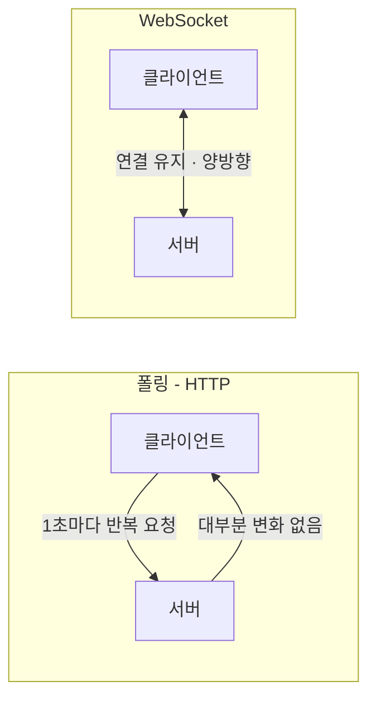
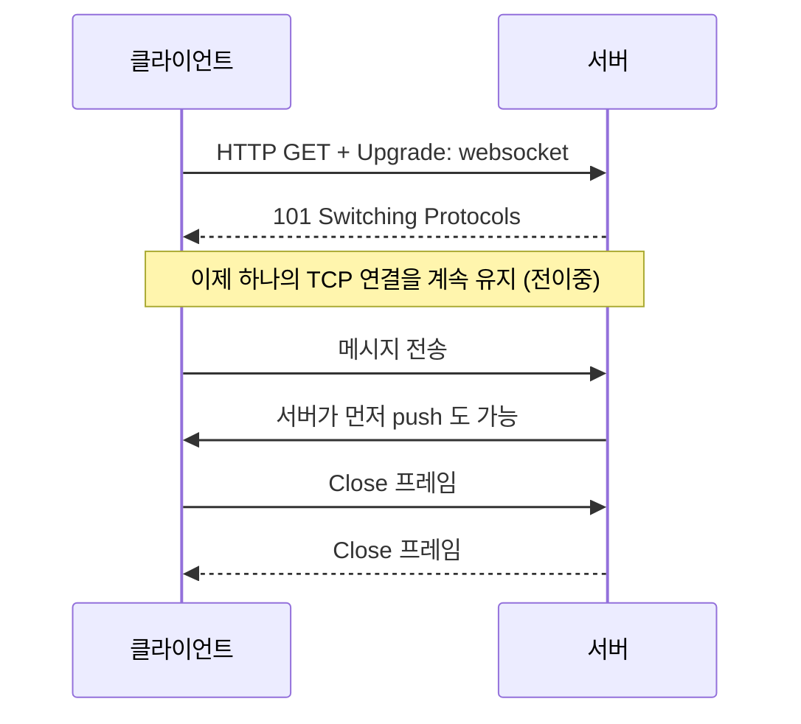
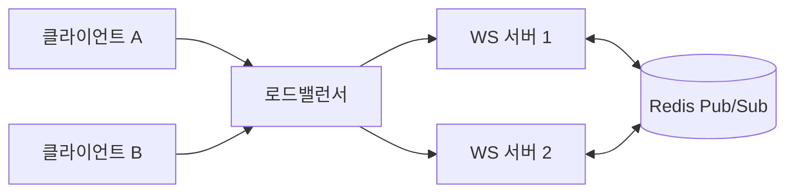

<aside class="callout callout--note"><span class="callout-icon" aria-hidden="true">💡</span><div class="callout-body"><p><strong>한 줄 요약</strong> — WebSocket은 하나의 TCP 연결을 계속 열어두고 <strong>서버와 클라이언트가 서로 아무 때나 메시지를 주고받는(전이중, full-duplex)</strong> 프로토콜이다. "새로고침 없이 실시간으로 반영되는 화면"의 대부분이 이것으로 만들어진다.</p></div></aside>

## 왜 WebSocket인가 — HTTP의 한계

기존 HTTP는 **"클라이언트가 물어봐야 서버가 답하는"** 요청-응답 구조다. 그래서 실시간처럼 보이게 하려면 클라이언트가 계속 물어봐야 했다(폴링). 대부분의 응답이 "바뀐 것 없음"이라 낭비가 크고, 서버가 **먼저** 알려줄 방법이 없다.



WebSocket은 연결을 **한 번만** 맺고 계속 유지하면서, 변화가 생기면 서버가 **즉시 밀어준다(push)**. 폴링의 낭비와 지연이 사라진다.

## WebSocket이란

- **전이중(full-duplex)**: 전화 통화처럼 양쪽이 동시에 말할 수 있다. (HTTP는 무전기처럼 한 번에 한 방향)
- **지속 연결**: 한 번 연결하면 명시적으로 닫기 전까지 유지된다.
- **주소 체계**: `ws://` (평문), `wss://` (TLS 암호화). **운영에서는 항상 `wss://`.**
- **첫 시작은 HTTP**: 방화벽·프록시를 그대로 통과하기 위해, 일반 HTTP 요청으로 시작해 연결을 "승격(Upgrade)"한다.

## 동작 흐름 — 핸드셰이크부터 종료까지



핵심은 **101 Switching Protocols** 응답이다. 이 순간부터 같은 연결이 HTTP를 벗어나 WebSocket 프레임을 주고받는 통로로 바뀐다.

## HTTP vs WebSocket

| 구분 | HTTP 요청-응답 | WebSocket |
| --- | --- | --- |
| 연결 | 요청마다 맺고 끊음 | 한 번 맺고 유지 |
| 방향 | 클라이언트가 시작 | 양쪽 모두 먼저 보낼 수 있음 |
| 서버 push | 불가(폴링 필요) | 가능 |
| 오버헤드 | 매 요청 헤더 | 최초 1회 + 가벼운 프레임 |
| 적합 | 문서·API 조회 | 실시간 양방향 |

## 최소 예제

**클라이언트 (브라우저)**

```js
const socket = new WebSocket('wss://example.com/chat');

socket.addEventListener('open', () => {
  socket.send(JSON.stringify({ type: 'join', room: 'general' }));
});

socket.addEventListener('message', (event) => {
  const data = JSON.parse(event.data);
  console.log('수신:', data);
});

socket.addEventListener('close', (e) => {
  console.log('연결 종료', e.code, e.reason);
});
```

**서버 (Node.js, ws 라이브러리)**

```js
import { WebSocketServer } from 'ws';

const wss = new WebSocketServer({ port: 8080 });

wss.on('connection', (ws) => {
  ws.on('message', (raw) => {
    const msg = JSON.parse(raw.toString());
    // 접속 중인 모든 클라이언트에게 브로드캐스트
    for (const client of wss.clients) {
      if (client.readyState === client.OPEN) {
        client.send(JSON.stringify(msg));
      }
    }
  });
});
```

## 언제 쓰고, 언제 쓰지 말까

<aside class="callout callout--tip"><span class="callout-icon" aria-hidden="true">✅</span><div class="callout-body"><p><strong>적합</strong> — 채팅·댓글, 실시간 알림, 협업 편집(구글 독스류), 실시간 대시보드·시세, 멀티플레이 게임처럼 <strong>양방향이거나 서버가 먼저 밀어줘야 하는</strong> 경우.</p></div></aside>

**항상 WebSocket이 정답은 아니다.** 가끔 갱신되는 데이터에 지속 연결을 쓰면 오히려 부담이다. 방향과 빈도에 맞는 대안을 고르자.

| 방식 | 방향 | 적합 상황 |
| --- | --- | --- |
| **WebSocket** | 양방향 | 채팅, 협업, 게임, 실시간 대시보드 |
| **SSE** (Server-Sent Events) | 서버→클라 단방향 | 알림, 피드, 진행률 스트리밍 |
| **롱 폴링** | 유사 실시간 | WebSocket 불가 환경의 폴백 |
| **WebRTC** | P2P 양방향 | 화상·음성 등 저지연 미디어 |

## 운영에서 마주치는 함정과 방지책

여기서부터가 실무다. "연결은 되는데 운영에서 터지는" 지점들이다.

| 함정 | 원인 | 방지책 |
| --- | --- | --- |
| 연결이 **조용히** 끊김 | 유휴 타임아웃, 네트워크 전환(와이파이↔LTE) | ping/pong **heartbeat** + **지수 백오프 재연결** |
| **좀비 연결** 누적 | close 이벤트 누락, 비정상 종료 | heartbeat 응답 없으면 서버가 강제 종료 |
| 스케일아웃 시 메시지 유실 | 서버마다 연결이 분산됨 | **Redis/Kafka Pub/Sub**로 서버 간 fan-out |
| 프록시·방화벽 차단 | 일부 중간 장비가 Upgrade 차단 | **wss(TLS)** 사용, idle timeout 넉넉히 설정 |
| 인증 우회(CSWSH) | 핸드셰이크에 CORS·SameSite가 적용되지 않음 | **Origin 검증 + 토큰 인증 + wss** |
| 메모리 폭증(백프레셔) | 느린 수신자에게 계속 송신 | `bufferedAmount` 확인, 메시지 크기·전송 속도 제한 |

### 스케일아웃: 서버가 여러 대면 상태를 공유해야 한다

서버가 1대일 때는 문제가 없다. 하지만 로드밸런서 뒤에 서버가 여러 대면, A 서버에 붙은 사용자와 B 서버에 붙은 사용자는 **서로 못 본다.** 브로커(Redis Pub/Sub 등)로 메시지를 모든 서버에 퍼뜨려야 한다.



<aside class="callout callout--warn"><span class="callout-icon" aria-hidden="true">⚠️</span><div class="callout-body"><p><strong>보안 — CSWSH(Cross-Site WebSocket Hijacking)</strong>. WebSocket 핸드셰이크에는 브라우저의 동일 출처 정책·쿠키 SameSite 보호가 <strong>그대로 적용되지 않는다.</strong> 쿠키 인증만 믿으면 다른 사이트에서 사용자의 연결을 가로챌 수 있다. 반드시 <strong>Origin 헤더를 검증</strong>하고, 쿠키 대신 <strong>핸드셰이크 시 토큰(예: 짧은 수명의 JWT)</strong>으로 인증하라.</p></div></aside>

## 실전: 견고한 재연결 (지수 백오프 + 지터 + heartbeat)

끊김은 "예외"가 아니라 **정상 상황**이다. 재연결과 heartbeat는 선택이 아니라 기본이다.

```js
const URL = 'wss://example.com/chat';

function connect() {
  const ws = new WebSocket(URL);
  let retry = 0;
  let pingTimer;

  ws.onopen = () => {
    retry = 0;
    // 25초마다 살아있는지 신호
    pingTimer = setInterval(() => ws.send(JSON.stringify({ type: 'ping' })), 25000);
  };

  ws.onclose = () => {
    clearInterval(pingTimer);
    // 지수 백오프(상한 30초) + 지터로 동시 재접속 폭주 방지
    const delay = Math.min(1000 * 2 ** retry, 30000) + Math.random() * 1000;
    retry += 1;
    setTimeout(connect, delay);
  };

  ws.onerror = () => ws.close();
}

connect();
```

<aside class="callout callout--tip"><span class="callout-icon" aria-hidden="true">✅</span><div class="callout-body"><p><strong>지터(jitter)를 꼭 넣어라.</strong> 서버가 잠깐 죽었다 살아나면 수천 명이 <em>동시에</em> 재접속해 서버를 다시 죽인다(thundering herd). 재연결 지연에 무작위 값을 섞으면 접속 시점이 분산된다.</p></div></aside>

## 복습 질문

<details class="toggle"><summary>1. WebSocket 연결은 왜 HTTP 요청으로 시작하나?</summary><div class="toggle-body"><p>기존 웹 인프라(프록시·방화벽·포트 80/443)를 그대로 통과하기 위해서다. 일반 HTTP GET에 <code>Upgrade: websocket</code>을 실어 보내고, 서버가 <code>101 Switching Protocols</code>로 답하면 같은 연결이 WebSocket으로 승격된다.</p></div></details>

<details class="toggle"><summary>2. 서버를 여러 대로 늘렸더니 일부 사용자끼리 메시지가 안 보인다. 왜?</summary><div class="toggle-body"><p>각 연결은 특정 서버 한 대에만 붙어 있다. 다른 서버에 붙은 사용자에게 전달하려면 Redis/Kafka 같은 Pub/Sub 브로커로 서버 간에 메시지를 퍼뜨려야 한다.</p></div></details>

<details class="toggle"><summary>3. 쿠키 인증만으로 WebSocket을 보호하면 안 되는 이유는?</summary><div class="toggle-body"><p>핸드셰이크에는 동일 출처 정책·SameSite 보호가 그대로 적용되지 않아 CSWSH 공격에 노출된다. Origin 검증 + 토큰 기반 인증 + wss를 함께 써야 한다.</p></div></details>

## 한 줄 정리

> "서버가 먼저 말을 걸어야 하는가?"가 Yes라면 WebSocket을 떠올려라. 단, **wss·재연결·heartbeat·Origin 검증·스케일아웃 브로커**는 세트로 따라온다는 것을 잊지 말자.
