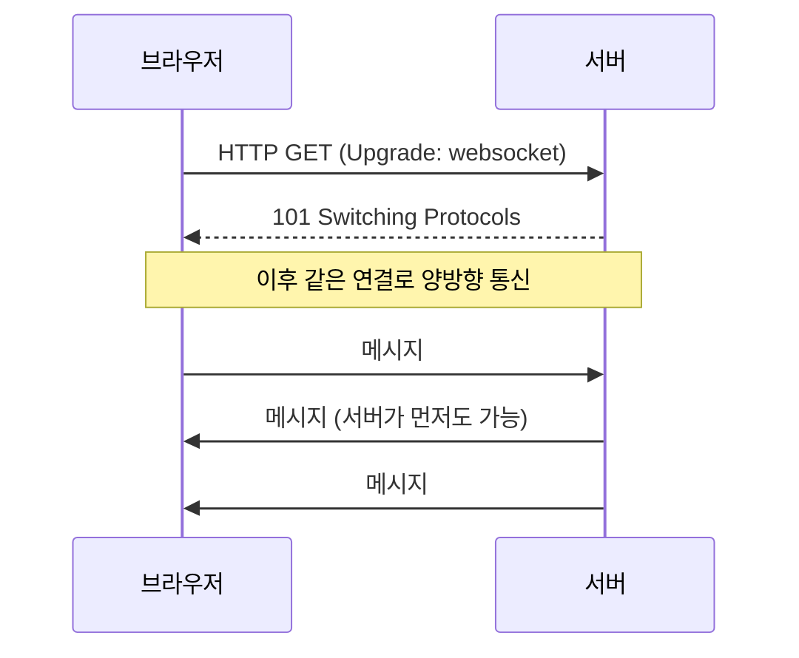
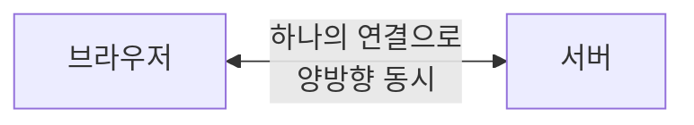

# 한 줄 요약

WebSocket은 브라우저와 서버가 **한 번 연결을 맺으면**, 그 연결로 양쪽이 **아무때나 실시간 메시지를 주고받는** 통신 방식이다. HTTP의 **"요청해야만 응답"** 한계를 넘는다.

<aside class="callout callout--note"><span class="callout-icon" aria-hidden="true">🎯</span><div class="callout-body"><p>비유: HTTP는 <strong>손님이 물어봐야 답하는 상점</strong>이고, WebSocket은 <strong>전화 통화</strong>다. 한번 연결되면 양쪽 모두 아무때나 먼저 말할 수 있다.</p></div></aside>

# 1. 왜 필요한가 — HTTP의 한계

HTTP는 **요청이 있어야 응답**한다. 서버가 먼저 뭐를 보낼 수 없다. 그래서 채팅·알림처럼 "서버가 먼저 알려줘야 하는" 기능엔 부적합하다.

예전엔 이를 흉내 내려고 **폴링 방법을 사용했다**.

<div class="table-wrap"><table><tr><th>방식</th><th>동작</th><th>문제</th></tr><tr><td><strong>폴링(Polling)</strong></td><td>몇 초마다 "새 거 있어?" 반복 요청</td><td>대부분 헛질, 서버 낭비·지연</td></tr><tr><td><strong>롱 폴링</strong></td><td>응답을 메시지 올 때까지</td><td>연결을 계속 재수립, 복잡</td></tr><tr><td><strong>WebSocket</strong></td><td>한 번 연결 후 양방향 상시 통신</td><td>연결 유지·관리가 필요</td></tr></table></div>

# 2. 어떻게 연결되나 — Handshake

재미있게도 WebSocket은 **HTTP로 시작**한다. 첫 요청에서 "프로토콜을 바꿔달라(Upgrade)"고 요청하고, 서버가 수락하면 그 연결이 WebSocket으로 전환된다.



<aside class="callout callout--tip"><span class="callout-icon" aria-hidden="true">💡</span><div class="callout-body"><p><strong>기존 포트를 그대로 쓴다.</strong> HTTP(80)·HTTPS(443) 포트에서 시작해 그대로 업그레이드되므로, 방화벽·프록시 통과가 수월하다. 주소 체계는 <code>ws://</code>(평문), <code>wss://</code>(암호화)를 쓴다.</p></div></aside>

# 3. 전이중(full-duplex) 통신

핸드쉐이크 뒤에는 **하나의 연결로 양쪽이 동시에** 말할 수 있다. 이걸 전이중(full-duplex)이라고 한다.



- 요청-응답처럼 번갈아 기다릴 필요가 없다.

- 서버가 **새 이벤트가 생기는 즉시** 클라이언트에 밀어준다(push).

- 메시지 단위는 "프레임"으로, HTTP보다 헤더 오버헤드가 작다.

# 4. 예제 — 브라우저에서 쓰기

브라우저에 `WebSocket` API가 기본 내장되어 있다.

```javascript
const ws = new WebSocket('wss://example.com/chat');

ws.onopen  = () => ws.send('안녕하세요');   // 연결되면 보내기
ws.onmessage = (e) => console.log('받음:', e.data); // 서버가 보낸 메시지
ws.onclose = () => console.log('연결 종료');
ws.onerror = (e) => console.error('오류', e);
```

<details class="toggle"><summary>한 줄씩 풀어보기</summary><div class="toggle-body"><ul><li><code>new WebSocket(url)</code> — 연결 시작(핸드쉐이크)</li><li><code>onopen</code> — 연결 성공 시점. 이후부터 <code>send()</code> 가능</li><li><code>onmessage</code> — 서버가 보낸 메시지 수신(서버가 먼저 보내도 여기로 들어옴)</li><li><code>wss://</code> — TLS 암호화(운영에선 반드시 이걸 쓴다)</li></ul></div></details>

# 5. 어디에 쓰나

<div class="table-wrap"><table><tr><th>사례</th><th>왜 WebSocket인가</th></tr><tr><td>채팅·메신저</td><td>양쪽이 수시로 메시지를 주고받음</td></tr><tr><td>실시간 알림</td><td>서버가 생기는 즉시 push</td></tr><tr><td>협업 편집(문서·화이트보드)</td><td>여러 사람의 변경을 즉시 동기화</td></tr><tr><td>실시간 시세·대시보드</td><td>끊임없이 갱신되는 수치</td></tr><tr><td>온라인 게임</td><td>낮은 지연의 양방향 통신</td></tr></table></div>

<aside class="callout callout--note"><span class="callout-icon" aria-hidden="true">📌</span><div class="callout-body"><p><strong>서버→클라이언트 한방향이면 SSE도 있다.</strong> 알림·피드처럼 서버가 보내기만 하면 된다면 <strong>SSE(Server-Sent Events)</strong> 가 더 간단하다. 양쪽이 활발히 주고받아야 할 때 WebSocket을 고른다.</p></div></aside>

# 6. 함정과 방지책

<aside class="callout callout--warn"><span class="callout-icon" aria-hidden="true">🧨</span><div class="callout-body"><p><strong>함정 1 — 연결은 끊긴다는 걸 잊음.</strong> 와이파이 끊김·모바일 전환·프록시 타임아웃으로 연결이 수시로 끊긴다.</p><p><strong>방지:</strong> 끊기면<strong> 백오프로 재연결</strong>하고, 놓친 메시지 복구(순번) 전략을 둔다.</p></div></aside>

<aside class="callout callout--warn"><span class="callout-icon" aria-hidden="true">🧨</span><div class="callout-body"><p><strong>함정 2 — 서버를 여러 대로 늘렸는데 메시지가 안 가요.</strong> 연결은 특정 서버에 묶여 있어, 다른 서버에 붙은 사용자에겐 안 전달된다.</p><p><strong>방지:</strong> 서버 간 메시지 공유를 위해 <strong>Redis Pub/Sub 같은 메시지 브로커</strong>를 둔다.</p></div></aside>

<aside class="callout callout--warn"><span class="callout-icon" aria-hidden="true">🧨</span><div class="callout-body"><p><strong>함정 3 — 죽은 연결을 몰라 자원을 낭비.</strong> 정상 종료 신호 없이 끊긴 연결이 쌓인다.</p><p><strong>방지:</strong> 주기적 <strong>하트비트(ping/pong)</strong> 로 살아있는지 확인하고, 응답 없으면 정리한다.</p></div></aside>

<aside class="callout callout--warn"><span class="callout-icon" aria-hidden="true">🧨</span><div class="callout-body"><p><strong>함정 4 — 인증·인가를 빼먹음.</strong> WebSocket은 한번 연결되면 계속 열려 있어, 연결 시점의 검증이 중요하다.</p><p><strong>방지:</strong> 핸드쉐이크 때 <strong>토큰으로 인증</strong>하고, 메시지마다 권한을 확인한다.</p></div></aside>
